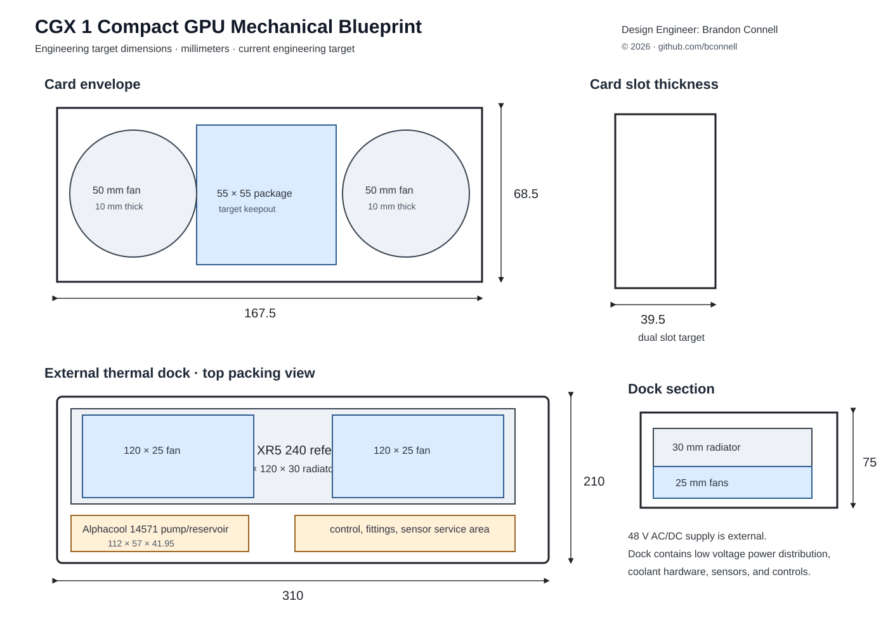
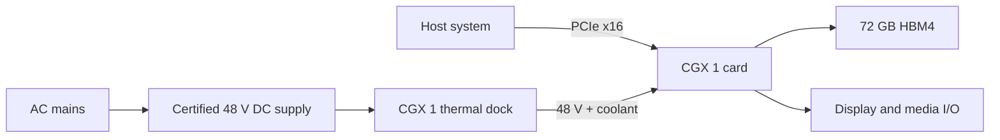

<div align="center">

# CGX 1

### Compact GPU Engineering Design

**167.5 mm card length · 72 GB HBM4 baseline · 6.6 TB/s target bandwidth · 143.36 TFLOPS target · 360 W dock mode**

[Engineering Specification](docs/ENGINEERING_SPEC.md) · [ISA](docs/ISA.md) · [Graphics Pipeline](docs/GRAPHICS_PIPELINE.md) · [Documentation Index](docs/README.md) · [Validation](docs/VALIDATION.md)

**Design Engineer:** [Brandon Connell](https://github.com/bconnell) · [LinkedIn](https://www.linkedin.com/in/brandon-c-b317a81b/) · [Email](mailto:brandon@brandonconnell.com)  
Copyright © 2026 Brandon Connell · [MIT License](LICENSE)

</div>

CGX 1 is a compact desktop GPU architecture built around a low profile, dual slot card and an external power and thermal dock. The design targets graphics, game development, 3D work, media processing, compute, and local AI workloads while remaining usable in hosts that cannot supply or remove full GPU power internally.

> **Current status:** Engineering architecture and prototype design. No CGX 1 ASIC has been fabricated. Target values are analytical design values unless a document explicitly identifies measured prototype data. See [Project Status](docs/STATUS.md).

> **Repository policy:** CGX 1 is published as a public engineering reference. This repository does **not** accept pull requests, issues, discussions, external patches, or other community contributions. The MIT license permits independent forks and derivative work, but those remain separate projects unless Brandon Connell explicitly incorporates a change. For work inquiries or a serious private security concern, use the contact information in [AUTHORS.md](AUTHORS.md).

[](mechanical/cgx1_blueprint.svg)

[Open the mechanical blueprint directly](mechanical/cgx1_blueprint.svg)

## Design at a glance

| Parameter | Target | Design intent |
|---|---:|---|
| Card PCB | **167.5 × 68.5 mm** | Short, low profile board for compact desktop chassis |
| Installed thickness | **39.5 mm, dual slot** | Keep the installed card inside a conventional dual slot envelope |
| Baseline memory | **72 GB HBM4** | Two 36 GB stacks adjacent to the processor package |
| Peak memory bandwidth | **6.6 TB/s** | Aggregate architecture target from two 3.3 TB/s stacks |
| Peak FP32 | **143.36 TFLOPS** | Arithmetic target from lane count and 2.80 GHz peak clock |
| Full performance power | **360 W nominal** | External power and liquid cooling required |
| Standalone slot mode | **≤ 70 W** | Reduced operation without the external dock |
| Docked host slot draw | **≤ 25 W** | Keep high power demand off the host PSU |
| External supply | **48 V DC** | Certified AC/DC supply remains outside the coolant dock |
| PCIe target | **Gen 6 ×16** | Backward interoperability target through earlier PCIe generations |
| Dock envelope | **310 × 210 × 75 mm** | Sized around an actual 240 mm radiator, fans, pump/reservoir, fittings, and control hardware |

## Architecture

CGX 1 separates the compact add in card from the equipment needed for sustained high power operation. The card can boot and operate from the PCIe slot at a reduced power level. Full performance mode uses a rear connected 48 V power and liquid cooling dock, while mains conversion stays in a separate certified AC/DC supply.



The silicon target uses four compute tiles, a central I/O and cache die, two 36 GB HBM4 stacks, and a package level cache. The dock moves the radiator, pump, reservoir, and most full load heat rejection outside the host chassis.

## Operating modes

| Mode | Board limit | Host slot behavior | Use |
|---|---:|---:|---|
| **P0 Safe Boot** | 25 W | Up to 25 W | Reset, diagnostics, unknown host state, dock fault fallback |
| **P1 Slot Eco** | 45 W | Up to 45 W | Reduced slot powered operation on a qualified host |
| **P2 Slot Max** | 70 W | Up to 70 W | Maximum slot powered operation on a qualified host |
| **P3 Dock Quiet** | 220 W | ≤ 25 W | Development, capture, and moderate rendering |
| **P4 Dock Full** | 360 W | ≤ 25 W | Full design power target |
| **Transient ceiling** | 450 W | External path | Short electrical excursions, not sustained operation |

If dock power or valid coolant flow is lost in P3 or P4, the reference controller returns to **P0 Safe Boot** rather than increasing host slot demand.

## Primary design specification

[design/cgx1_architecture.json](design/cgx1_architecture.json) is the primary machine readable file for shared numeric targets. The repository validation scripts check important values mirrored in documentation, CAD, firmware, and the analytical model.

| Item | CGX 1 target | Notes |
|---|---:|---|
| Compute tiles | 4 | Separate graphics/compute tiles around the central I/O die |
| Compute units | 200 | 50 per tile |
| FP32 lanes | 25,600 | 128 per compute unit |
| Sustained clock target | 2.65 GHz | Full load design target |
| Peak clock target | 2.80 GHz | Used for peak FP32 arithmetic |
| Peak FP32 target | 143.36 TFLOPS | Not a measured benchmark |
| VRAM baseline | 72 GB HBM4 | Two 36 GB stacks |
| Future memory target | 96 GB HBM4 | Two 48 GB stacks if package and supply constraints permit |
| Package level cache target | 512 MB | Architecture target |
| Display target | 3 × Mini DisplayPort 2.1b + USB C DisplayPort Alt Mode | Final PHY and compliance work remains |
| Media target | 4 encode + 4 decode engines, AV1 | Architecture target |

## Architecture definition

The critical software-visible and multi-tile contracts are now defined rather than left to later RTL work:

| Area | Current architecture decision | Document |
|---|---|---|
| Execution | Native wave32; four SIMD32 partitions per CU; 32-bit base ISA with extension word | [ISA](docs/ISA.md) |
| Matrix engines | Four engines per CU; wave32; M16N16K16 FP16/BF16 and M16N16K32 FP8/INT8; fixed fragment map and 16-cycle issue target | [Matrix Engine Architecture](docs/MATRIX_ENGINE.md) |
| Graphics | One logical GPU; 16 raster partitions; dynamic 32 × 32 pixel macro-tile ownership | [Graphics Pipeline](docs/GRAPHICS_PIPELINE.md) |
| Texture | 100 texture blocks; four bilinear samples/block/cycle arithmetic target | [Texture and Compression](docs/TEXTURE_COMPRESSION.md) |
| Compression | Lossless 256-byte surface blocks; no guaranteed compression ratio | [Texture and Compression](docs/TEXTURE_COMPRESSION.md) |
| Chiplet fabric | Central coherent I/O die; directory coherence; 7.2 TB/s aggregate read payload budget | [Chiplet Fabric](docs/CHIPLET_FABRIC.md) |
| Virtual memory | 57-bit GPU VA; 4 KiB/64 KiB/2 MiB pages; replayable faults; ATS/PASID optional | [Virtual Memory](docs/VIRTUAL_MEMORY.md) |
| Scheduling | 64 resident hardware queue contexts; 8 priorities; bounded preemption/reset escalation | [Scheduling and Preemption](docs/SCHEDULING_PREEMPTION.md) |
| Power management | Per-tile DVFS/power gating policy inside unchanged P0-P4 board limits; no fixed tile count per P-state | [Power Management](docs/POWER_MANAGEMENT.md) |

These values are design targets. They do not represent fabricated silicon capability or measured application performance.

## Prototype path

The first physical prototype does not require custom GPU silicon. **P0** is a dimensionally accurate electrothermal card and external dock used to validate fit, power distribution, coolant routing, control firmware, and a 360 W thermal load. **P1** adds a shared programmable HBM accelerator to the bench for PCIe, memory traffic, control, and software experiments.

| Stage | Hardware | What it establishes |
|---|---|---|
| **P0** | Card carrier, heaters, controller, cold plate, dock, instrumentation | Mechanical fit, 48 V delivery, cooling behavior, fault handling, firmware states |
| **P1** | P0 infrastructure plus an HBM capable programmable accelerator | PCIe behavior, memory traffic, host communication, selected RTL and software experiments |
| **Custom silicon** | Fabricated package and production class board | Device functionality, drivers, conformance, characterization, measured application performance |

See [Prototype Build](docs/PROTOTYPE_BUILD.md), [Mechanical Design](docs/MECHANICAL_DESIGN.md), and [Electrical Interface](docs/ELECTRICAL_INTERFACE.md).

## Documentation

The complete engineering document set is listed in the [Documentation Index](docs/README.md).

| Document | What it contains | Link |
|---|---|---|
| Engineering Specification | Card, package, silicon, memory, power, display, media, reliability | [Open](docs/ENGINEERING_SPEC.md) |
| ISA and Execution Model | Wave model, registers, instruction classes, memory ordering and faults | [Open](docs/ISA.md) |
| Matrix Engine Architecture | Numeric contract, physical tile shapes, wave32 fragment mapping, ISA opcodes, pipeline timing, and dense rate targets | [Open](docs/MATRIX_ENGINE.md) |
| Graphics Pipeline | Multi-tile geometry, raster, ownership, depth and presentation flow | [Open](docs/GRAPHICS_PIPELINE.md) |
| Texture and Compression | Sampler organization and lossless surface compression | [Open](docs/TEXTURE_COMPRESSION.md) |
| Chiplet Fabric | Tile links, coherence, bandwidth budget, reliability and QoS | [Open](docs/CHIPLET_FABRIC.md) |
| Virtual Memory | GPU address spaces, pages, faults, residency, ATS/PASID integration | [Open](docs/VIRTUAL_MEMORY.md) |
| Scheduling and Preemption | Queue model, priorities, preemption and reset containment | [Open](docs/SCHEDULING_PREEMPTION.md) |
| Power Management | Per-tile DVFS, gating, board-budget enforcement and safe transition ordering | [Open](docs/POWER_MANAGEMENT.md) |
| Project Status | What is implemented, modeled, planned, or not yet built | [Open](docs/STATUS.md) |
| Mechanical Design | Card and dock dimensions, selected prototype components, packing assumptions | [Open](docs/MECHANICAL_DESIGN.md) |
| Electrical Interface | Slot power, 48 V input, isolation, fallback behavior, interlocks | [Open](docs/ELECTRICAL_INTERFACE.md) |
| Thermal and Power | 360 W budget, coolant arithmetic, thermal assumptions | [Open](docs/THERMAL_POWER.md) |
| Prototype Build | P0 and P1 construction and acceptance work | [Open](docs/PROTOTYPE_BUILD.md) |
| Prototype Procurement | Consumables, equipment, prices, exact parts, substitutes | [Open](docs/PROTOTYPE_PROCUREMENT.md) |
| Prototype Unit Cost | Per unit planning after bench equipment is owned | [Open](docs/PROTOTYPE_UNIT_COST.md) |
| Software Stack | Firmware, kernel, graphics, compute, media, compiler, and diagnostics plan | [Open](docs/SOFTWARE_STACK.md) |
| Validation | Repository, model, firmware, mechanical, P0, P1, and future silicon checks | [Open](docs/VALIDATION.md) |
| Test Record Template | Standard fields for measured prototype test records | [Open](docs/TEST_RECORD_TEMPLATE.md) |
| Reference Comparison | Dated comparison against shipping reference GPUs | [Open](docs/REFERENCE_COMPARISON.md) |
| Sources | Public technical and procurement references | [Open](docs/SOURCES.md) |
| Roadmap | Remaining prototype and silicon work | [Open](docs/ROADMAP.md) |

## Build and test

A standard CMake toolchain is sufficient for the current analytical model, ISA reference tests, matrix numeric, physical-architecture, and register-interface schedule tests, power-management policy tests, and firmware tests.

```text
cmake -S . -B build
cmake --build build --config Release
ctest --test-dir build --output-on-failure -C Release
```

The complete Windows repository gate can be run locally with:

```powershell
.\scripts\validate_windows.ps1
```

The gate checks public wording, private and local residue, PowerShell parsing, design consistency, local Markdown links, the C and C++ build, negative controls, and the executable tests.

## Reference comparison

The dated comparison uses NVIDIA RTX PRO 6000 Blackwell Workstation Edition as the primary workstation reference and GeForce RTX 5090 as a gaming reference. CGX figures remain architecture targets. Shipping product specifications are kept separate from analytical CGX values and measured performance is not inferred from arithmetic throughput.

See [Reference GPU Comparison](docs/REFERENCE_COMPARISON.md).

## License and contact

CGX 1 is released under the [MIT License](LICENSE).

**Design Engineer:** [Brandon Connell](https://github.com/bconnell)  
**Work contact:** [brandon@brandonconnell.com](mailto:brandon@brandonconnell.com)  
**LinkedIn:** [Brandon Connell](https://www.linkedin.com/in/brandon-c-b317a81b/)  
**Copyright:** © 2026 Brandon Connell

The copyright notice is carried in [LICENSE](LICENSE). Work contact information is also carried in [AUTHORS.md](AUTHORS.md), [NOTICE.md](NOTICE.md), and [CITATION.cff](CITATION.cff) so it remains easy to find in redistributed source packages.
